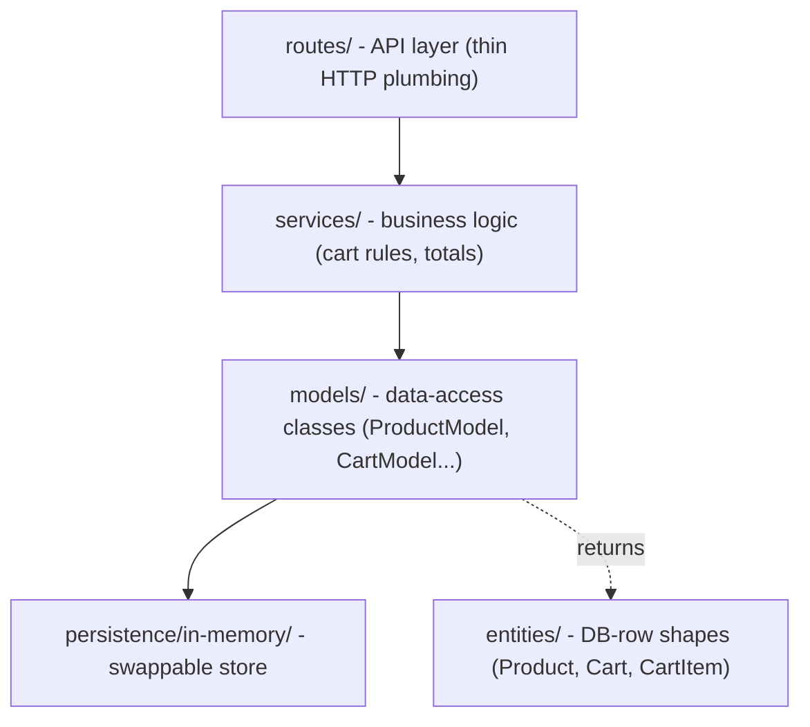

# PetCircle

Pet e-commerce shopping cart prototype.

Canonical requirements: [`Requirement.md`](Requirement.md)

Architecture and decisions: [`docs/INDEX.md`](docs/INDEX.md)

## Prerequisites

- Node.js 22 LTS (see [`.nvmrc`](.nvmrc))
- pnpm 9 (see `packageManager` in [`package.json`](package.json))

## Setup

```bash
pnpm install
```

## Code quality

From the **repository root**:

```bash
pnpm lint           # ESLint
pnpm lint:fix       # ESLint with auto-fix
pnpm format:check   # Prettier check
pnpm format         # Prettier write
```

## Frontend (hello world)

Run from the **repository root**:

```bash
pnpm dev:web      # → http://localhost:5173
pnpm build:web    # production build
pnpm test:web     # Vitest smoke test
```

The web app lives in [`apps/web`](apps/web). Copy [`apps/web/.env.example`](apps/web/.env.example) to `apps/web/.env` when connecting to the API.

## Backend (hello world)

For local dev, optionally copy [`apps/api/.env.example`](apps/api/.env.example) to `apps/api/.env` to override defaults. The server runs without `.env` using built-in defaults (`PORT=3000`, `CORS_ALLOWED_ORIGINS=http://localhost:5173`).

```bash
cp apps/api/.env.example apps/api/.env   # optional
```

Run from the **repository root**:

```bash
pnpm dev:api      # → http://localhost:3000
pnpm build:api    # tsc emit to apps/api/dist
pnpm test:api     # Vitest + supertest
```

Manual checks:

```bash
curl http://localhost:3000/health
curl http://localhost:3000/hello
curl http://localhost:3000/products
curl http://localhost:3000/cart
curl -X POST http://localhost:3000/cart/items \
  -H 'Content-Type: application/json' \
  -d '{"productId":"prod-001","quantity":1}'
curl -X PATCH http://localhost:3000/cart/items/prod-001 \
  -H 'Content-Type: application/json' \
  -d '{"quantity":5}'
curl -X DELETE http://localhost:3000/cart/items/prod-001
```

**Startup seed (prototype hack):** on boot, `createModels()` loads 10 products and cart id `1` into the in-memory store. Tests use the same path with a fresh store (no real DB). See [ADR 0009](docs/decisions/0009-api-design-conventions.md).

### Cart APIs

| Method | Path | Notes |
|--------|------|-------|
| `GET` | `/products` | Full catalog |
| `GET` | `/cart` | Current cart (`cartId` `1` via resolver; client does not send cart id) |
| `POST` | `/cart/items` | Body `{ productId, quantity }` — create or **increment**; returns updated cart |
| `PATCH` | `/cart/items/:productId` | Body `{ quantity }` — **set** absolute quantity; returns updated cart |
| `DELETE` | `/cart/items/:productId` | Removes line; returns updated cart |

The API lives in [`apps/api`](apps/api). Shared REST response types live in [`packages/api-types`](packages/api-types).

## Monorepo layout

```text
apps/
  api/         Node + Express + TypeScript API
    src/
      entities/           DB-row shapes (Product, Cart, CartItem, Entity base)
      models/             data-access classes (ProductModel, CartModel...)
      persistence/
        in-memory/        swappable store (in-memory now, real DB later)
      services/           business logic (cart rules, totals, validation)
      routes/             thin HTTP layer (calls services)
  web/         React + Vite + TypeScript SPA
packages/
  api-types/   REST request/response types (shared by FE and BE)
```

## Backend architecture

The API is organized into layers with a single direction of dependency (see [ADR 0013](docs/decisions/0013-backend-layering.md)):



- **entities/** — pure DB-row shapes (data only); map 1:1 to future DB tables.
- **models/** — ActiveRecord/ORM-style data-access classes (`findAll`/`findById`/`save`/`delete`); the class the app works with. Naming: entity `Product` → model `ProductModel`.
- **persistence/in-memory/** — the store models talk to; an in-memory `Map` isolated behind an interface so a real DB adapter can replace it with minimal change.
- **services/** — business logic (add/increment/remove, totals, validation); cart methods take `cartId`.
- **routes/** — thin HTTP layer; `resolveCurrentCartId` then services; map to api-types ([ADR 0009](docs/decisions/0009-api-design-conventions.md)).
- **Seed-on-boot** — `createModels()` seeds the in-memory adapter at startup (prototype hack).
